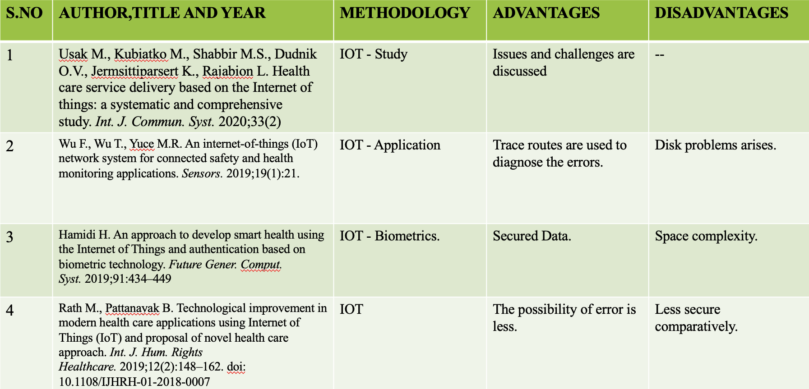
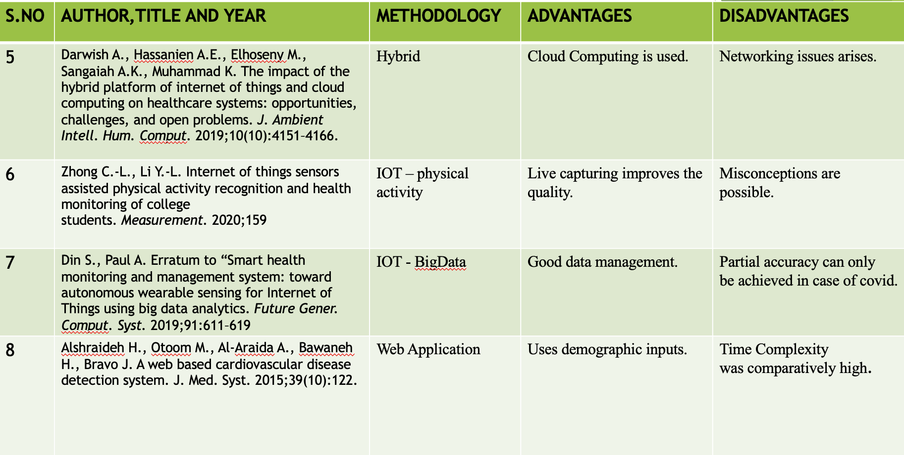
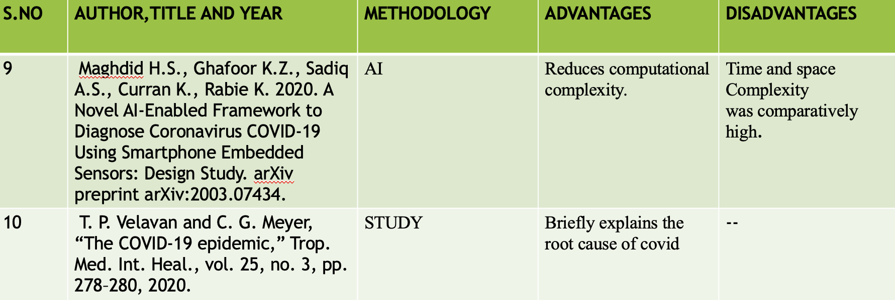
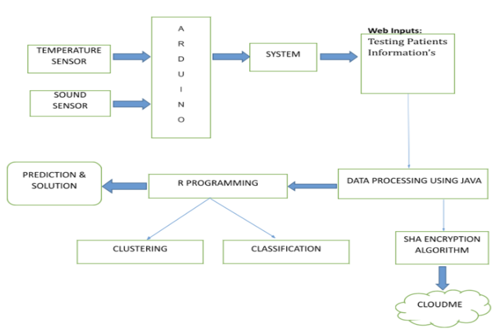
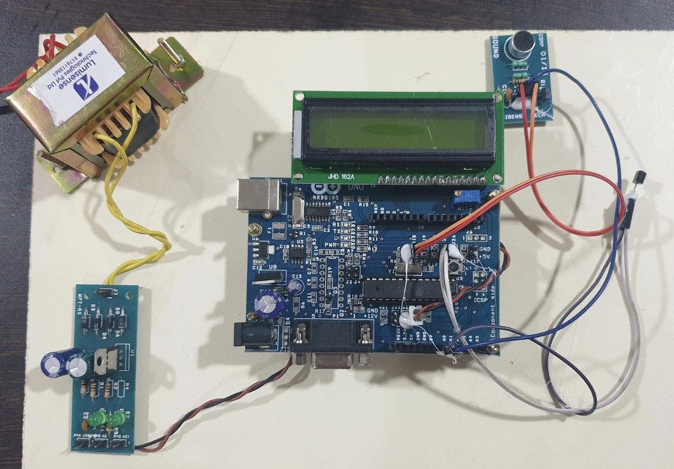
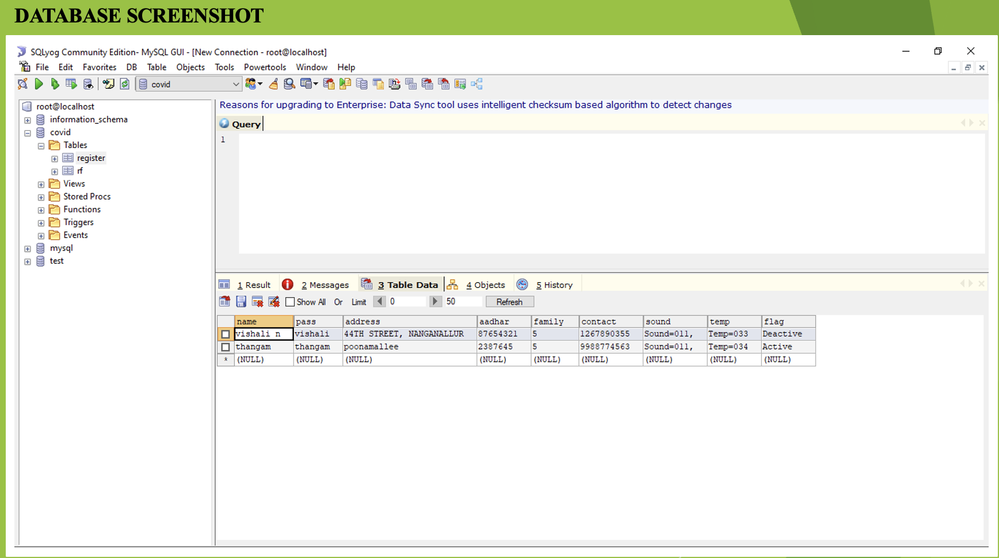
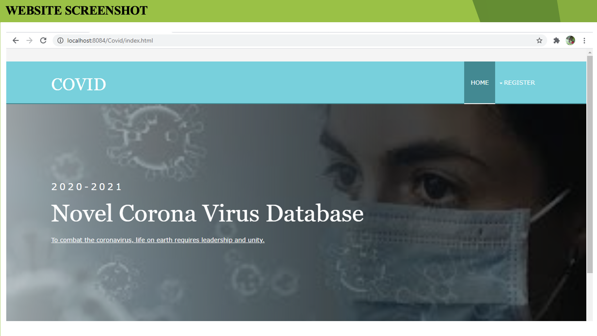
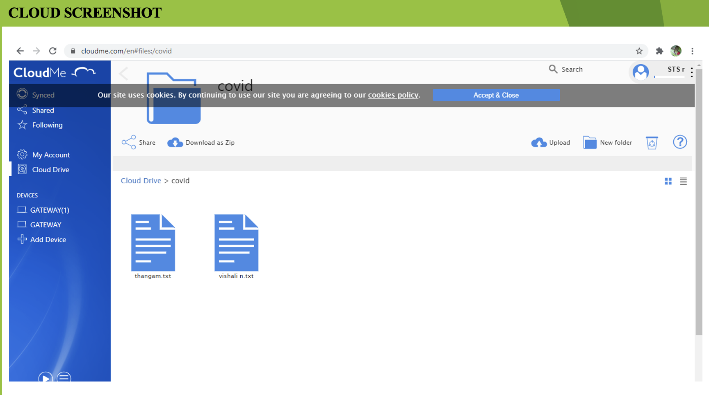
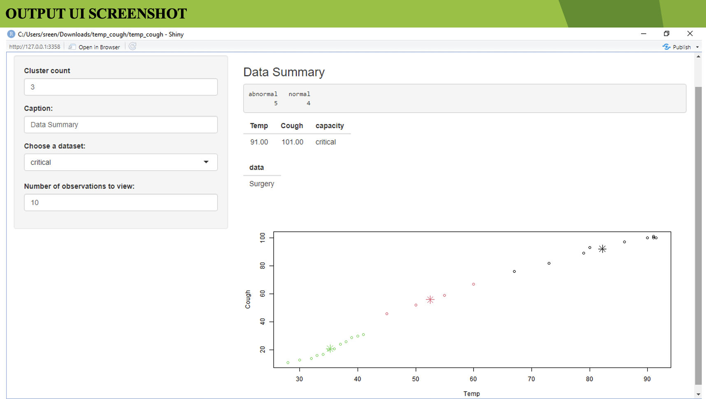

# Covid19-Prediction
COVID Positive Patients Detection Using Sensors, IOT And Data Analytics Techniques.

<h2>Objective:</h2>
<ul><li>The main goal is to use real-time data to investigate Covid Positive patients.</li>
<li>The healthcare system can potentially help to prevent for coronavirus spreading wider.</li>
<li>Predicts the corona disease and recommend health preventive measure based on the level of fever to be executed.</li>
<li>The government would be updated with each and every citizens health information which would make their monitoring task simple and completely reduces the human efforts and errors.</li></ul>

<h2>Abstract:</h2>
<ul><li>3 phases are proposed such as real-time data collection, data sharing and data analytics.</li>
<li>The sensor data are connected with Arduino from which is been transmitted to java using comport and dynamically collected in the database (MySQL).</li>
<li>The collected data are encrypted using SHA algorithm and converted into hash values and stored in the public cloud for global access.</li>
<li>The analytics team can pull the data from the system and convert to .CSV format and provide to RStudio for analytics.</li>
<li>In R programming we perform grouping of data (clustering) using k-means algorithm and conditions, solutions are trained for each clusters is performed using naive bayes classifier.</li>
<li>Proposed design has high in demands from the healthcare system and can potentially help to prevent for coronavirus spreading wider.</li></ul>

<h2>Literature Survey:</h2>

<h2>Proposed Work:</h2>
<ul><li>In the proposed system, sound (cough) and temperature (fever) sensors are used to detect the high fever of the infected people.</li>
<li>The heath parameters along with people information would be uploaded in the cloud server (heath ministry).</li>
<li>The sensor data are connected with Arduino from which its been transmitted to java using comport and dynamically collected in the database (MySQL).</li>
<li>The collected data are encrypted using SHA algorithm and converted into hash values and stored in the public cloud for global access.</li>
<li>In R programming we perform grouping of data (clustering) using k-means algorithm and conditions, solutions are trained for each clusters is performed using naive bayes classifier.</li>
<li>The machine learning model employed to predict the corona disease and recommend health preventive measure based on the level of fever to be executed.</li>
<li>The data mining method used here is simple and easy to implement that is highly scalable and comparatively fast.</li></ul>

<h2>Architecture Diagram:</h2>

<h2>Input Acquisition from Sensors:</h2>
<ul><li>Temperature sensor we used here is LM35. It does not require any external calibration or trimming to provide typical accuracies.</li>
<li>The electronics and components within machines begin to move back and forth, the vibration is preventing a smooth flow of energy.(vibration sensor)</li>
<li>The Sound sensor is a small board that combines a microphone and some processing circuitry. It provides not only an audio output, but also a binary indication of the presence of sound, and an analog representation of its amplitude.</li></ul>

<h2>Microcontroller Programming:</h2>
<ul><li>The Arduino Uno is a microcontroller board based on the ATmega328 (datasheet). It has 14 digital input/output pins (of which 6 can be used as PWM outputs), 6 analog inputs, a 16 MHz crystal oscillator, a USB connection, a power jack, an ICSP header, and a reset button.</li>
<li>Simply connect it to a computer with a USB cable or power it with a AC-to-DC adapter or battery to get started.</li>
<li>The Uno is the latest in a series of USB Arduino boards, and the reference model for the Arduino platform.</li></ul>

<h2>Data Processing:</h2>
<ul><li>API by Java developers, it still provides all the necessary functionality for proper serial communications. In order to make the API portable across platforms, the API defines an abstract SerialPort class.</li>
<li>SHA is currently the most widely used SHA hash function. SHA outputs a 160­bit digest of any sized file or input. In construction it is similar to the previous MD4 and MD5 hash functions, in fact sharing some of the initial hash values. It uses a 512 bit block size and has a maximum message size of 21 bits.</li>
<li>Cloud storage is a model of data storage where the digital data is stored in logical pools, the physical storage spans multiple servers (and often locations), and the physical environment is typically owned and managed by a hosting company.</li></ul>

<h2>Data Analysis:</h2>
<ul><li>R is a programming language and software environment for statistical analysis, graphics representation and reporting.</li>
<li><b>Clustering</b>: K Means Clustering. 
    <b>Classification</b>: Naive Bayes.</li>
<li>Clustering or grouping comes under unsupervised learning. The things which have comparative qualities are placed in a similar cluster. This calculation is called k-means. Which is a least complex calculation and famous unaided unsupervised learning method.</li>
<li>Naive Bayes is a classification algorithm for binary (two-class) and multi-class classification problems. The technique is easiest to understand when described using binary or categorical input values.</li></ul>

<h2>Conclusion:</h2>
<ul><li>The worldwide pandemic of COVID-19 majorly affects life. There has been a noteworthy increment in the number of infections in individuals worldwide. </li>
<li>Several nations, governments and researchers are attempting to adapt to this worldwide emergency. </li>
<li>This summarizes a comprehension of infection transmission of SARS-CoV-2 and knowledge of the state of art diagnostic methods approach based on sensor applications, machine learning techniques.</li>
<li>Thus our proposed project study integrating real time data collection, data sharing and data analytics would provide promising results.</li></ul>

<h2>Future Enhancement:</h2>
<ul><li>Additionally, images of infected lungs can be added, as the lung is the most crucial organ that is affected by the coronavirus resulting in pneumonia.</li>
<li>Infection with SARS-CoV-2 begins when respiratory droplets containing the virus enter your upper respiratory tract. As the virus multiplies, the infection can progress to your lungs.</li>
<li>When this happens, it’s possible to develop pneumonia. As a result we might perform image processing to enhance the efficiency and accuracy. </li>
<li>Finally,  several challenges and issues related to  COVID-19 medical image processing can be discussed, which are expected to drive further studies in controlling the outbreak and controlling the crisis, which results in smart healthy cities. </li></ul>

